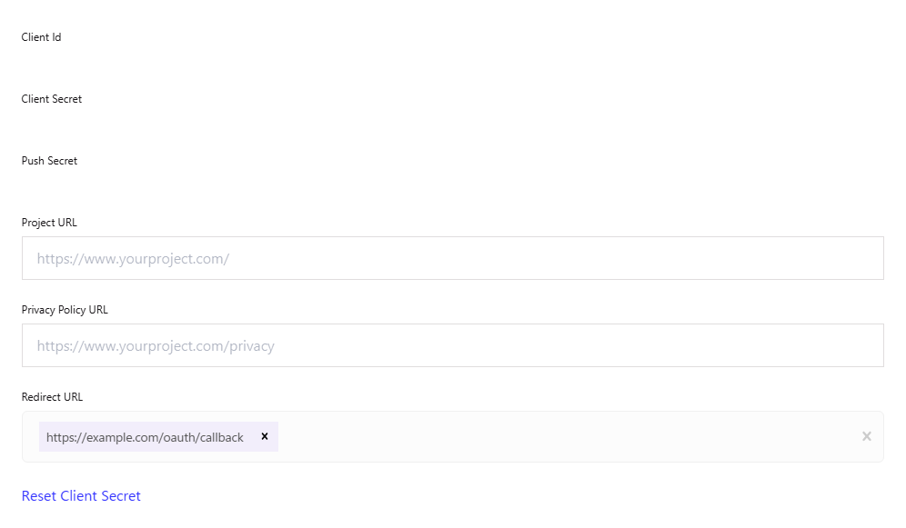
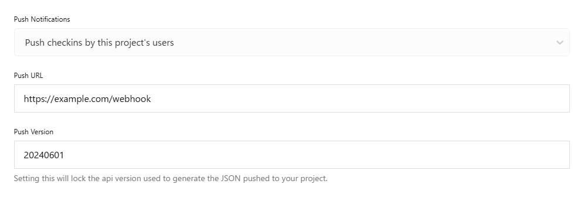

[English](README.md) | [日本語](README.ja.md)

# Swarm Linker

An application that posts check-ins on Swarm to X (Twitter).

## Overview

When a check-in is made on Swarm, the application receives a webhook and posts to X (Twitter).  
The posted text will be as follows. Note that comments and images will not be included in the post.

```
I'm at [Venue name] in [Venue address]
[Share URL]
```

## API Endpoints

- `GET /oauth` - Initiates authorization to obtain the access token.
- `GET /oauth/callback` - Handles the redirect from Foursquare after authentication to obtain the access token.
- `POST /webhook` - Receives check-in webhooks and posts to X (Twitter).

## Requirements

- Cloudflare Workers
- [Node.js](https://nodejs.org/)

## Dependencies

- Cloudflare Workers Node.js compatibility
  - [node:crypto](https://developers.cloudflare.com/workers/runtime-apis/nodejs/crypto/)
- [oauth-1.0a](https://github.com/ddo/oauth-1.0a)

## Usage

### 0. Preparations

Run the following command to log in to Cloudflare.

```sh
npx wrangler login
```

### 1. Deploy

Run the following command to deploy to Cloudflare.

```sh
npx wrangler deploy
```

The displayed URL `https://***.workers.dev` is the API's base URL.

### 2. Set Up Secrets

> [!TIP]
> When running locally, use a `.env` file instead of Secrets.  
> Create a `.env` file based on the `.env.example` file.

#### Foursquare Settings

Set the Foursquare API version. Unless you have a specific reason, set it to `20240601`.

```sh
npx wrangler secret put FOURSQUARE_API_VERSION
```

Obtain and set the following credentials from [Foursquare Developer Console](https://location.foursquare.com/developer/).

```sh
npx wrangler secret put FOURSQUARE_API_KEY
npx wrangler secret put FOURSQUARE_API_KEY_SECRET
npx wrangler secret put FOURSQUARE_PUSH_SECRET
```

Set the URL to access `/oauth/callback` (for example, `https://***.workers.dev/oauth/callback` ).

```sh
npx wrangler secret put FOURSQUARE_REDIRECT_URI
```

#### X (Twitter) Settings

Obtain and set the following credentials from [X (Twitter) Developer Console](https://console.x.com/).

```sh
npx wrangler secret put TWITTER_API_KEY
npx wrangler secret put TWITTER_API_KEY_SECRET
npx wrangler secret put TWITTER_ACCESS_TOKEN
npx wrangler secret put TWITTER_ACCESS_TOKEN_SECRET
```

### 3. Configure Foursquare Developer Console

Access [Foursquare Developer Console](https://location.foursquare.com/developer/) and configure the following.

#### OAuth Authentication Settings

- `Redirect URL` - Set the URL to access `/oauth/callback` (for example, `https://***.workers.dev/oauth/callback` ).



#### Push API Settings

- `Push Notifications` - Select `Push checkins by this project's users`.
- `Push URL` - Set the URL to access `/webhook` (for example, `https://***.workers.dev/webhook` ).
- `Push Version` - Set the push API version. Unless you have a specific reason, set it to `20240601`.



### 4. Authenticate with Foursquare

Open `https://***.workers.dev/oauth` in your browser and authenticate with Foursquare.  
After authentication, add the access token displayed in the browser to Secrets.

```sh
npx wrangler secret put FOURSQUARE_ACCESS_TOKEN
```

## License

This software is licensed under the [Unlicense](LICENSE).
